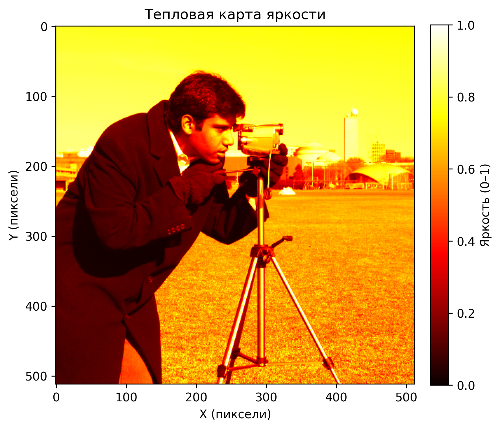

# 🔥 Построение тепловой карты яркости изображения

## 📌 Описание

Скрипт строит тепловую карту яркости изображения:

1. Загружает изображение (из файла или встроенное `skimage.data.camera`, если файл не указан).
2. Переводит его в оттенки серого.
3. Нормирует значения в диапазон `[0, 1]`.
4. Отображает карту с палитрой `cmap='hot'` и цветовой шкалой (`colorbar`).
5. Может сохранять результат в PNG или просто показать на экране.

## 🚀 Установка

Требуются Python ≥ 3.8 и библиотеки:

```bash
pip install numpy matplotlib scikit-image
```

## ▶️ Использование

### Встроенное изображение (по умолчанию `skimage.data.camera`)

```bash
python heatmap.py
```

Результат будет сохранён в файл **heatmap.png**.

---

### Собственное изображение

```bash
python heatmap.py --image my_image.jpg
```

---

### Сохранение в указанный файл

```bash
python heatmap.py --image my_image.jpg --save output.png
```

---

### Только показать без сохранения

```bash
python heatmap.py --image my_image.jpg --no-save
```

---

## ⚙️ Аргументы CLI

- `--image` — путь к изображению (по умолчанию используется встроенное).
- `--save` — имя PNG-файла для сохранения (по умолчанию `heatmap.png`).
- `--no-save` — отключает сохранение и показывает результат только на экране.

## 📊 Пример результата

Ниже приведён пример тепловой карты, построенной для встроенного изображения `skimage.data.camera()`:



- Цветовая палитра: `hot`  
- Цветовая шкала (`colorbar`) показывает нормализованные значения яркости (0–1)  
- Можно отключить оси, если они не нужны, через флаг `--no-save` или параметр `show_axes=False` в функции
